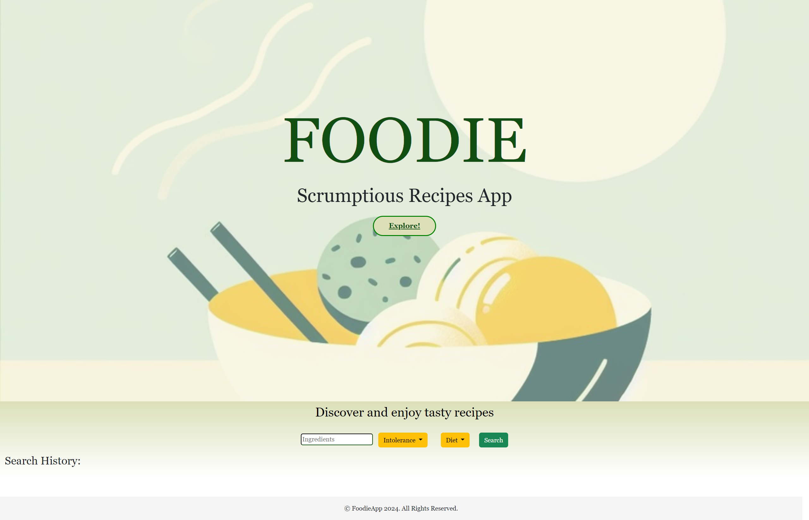
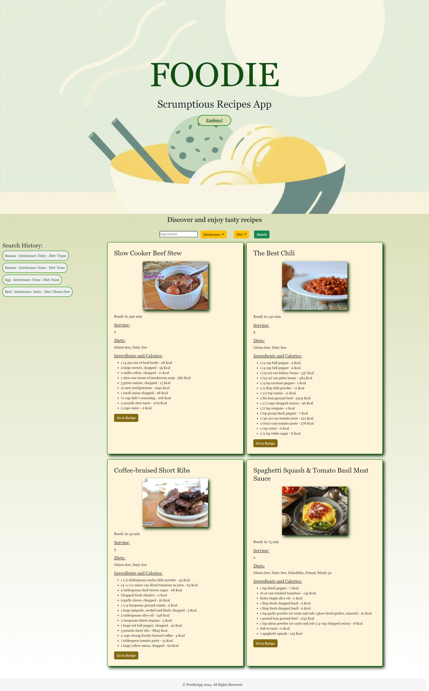
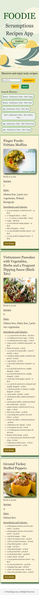

# Foodie-Recipes-App

## Description
The Foodie App enables users to discover recipes based on ingredients, dietary preferences, and intolerances. If users have specific ingredient/s at their disposal, they can initiate a search and receive up to four recipes featuring that ingredient/s for inspiration.

Once the recipes are displayed, users also receive information about the calories of each ingredient, allowing them to assess the overall healthiness of the recipe.

The app utilizes Local Storage to save information about ingredients, intolerances, and dietary preferences previously searched by the user. This means that when the page is refreshed, the buttons associated with previous searches remain on the page for easy access.

The code uses two server-side food APIs: Spoonacular https://spoonacular.com/food-api and Edamam https://www.edamam.com/.

This app runs in the browser and features dynamically updated HTML and CSS powered by JavaScript. 

The code is deployed at https://rgc1.github.io/Foodie-Recipes-App/

## Screenshots

## Installation

This code can be installed clicking on the "Code" green button above and git cloning the SSH to your local terminal.

## Usage

Users can discover recipes that align with the ingredient/s they have at their disposal, and they can further customize their search by specifying any intolerances or dietary preferences. Additionally, users have the option to view calories information for each ingredient.

## Credits

Bootstrap https://getbootstrap.com/

jQuery https://jquery.com/

Server-side APIs from:
- Spoonacular https://spoonacular.com/food-api 
- Edamam https://www.edamam.com/

Excalidraw - for wireframing  https://excalidraw.com/

Microsoft Designer - background image creation - https://designer.microsoft.com/

## License

MIT License

## Badges

